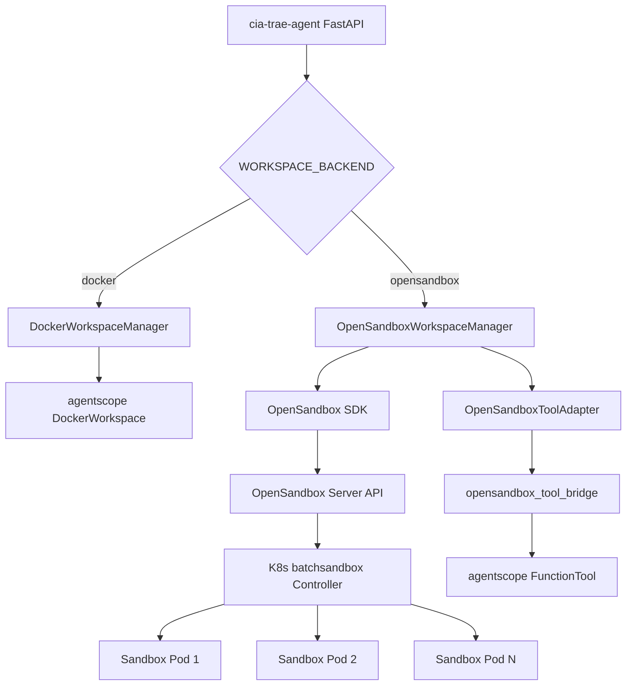

# OpenSandbox 沙箱能力建设方案

## 1. 方案概述

### 1.1 背景与目标

当前 cia-trae-agent 项目使用 agentscope 框架的 `DockerWorkspace` 作为代码执行沙箱，存在以下瓶颈：

| 问题 | 影响 |
| --- | --- |
| 单机 Docker 依赖 | 无法水平扩展，应用重启丢失所有工作区 |
| 容器生命周期与应用耦合 | 应用异常退出后容器泄漏 |
| 无集中管控 | 无法统一监控资源使用、限制配额 |
| 隔离性有限 | 共享 Docker daemon，存在逃逸风险 |

**目标**：引入 OpenSandbox（基于 K8s 的沙箱编排平台）替代单机 Docker，实现：

*   沙箱生命周期由 K8s 集群统一管控
    
*   支持多节点水平扩展
    
*   提供 API 化的沙箱创建/销毁/续期能力
    
*   保持与现有 agentscope 工具链的完全兼容
    

### 1.2 技术选型对比

| 维度 | Docker (agentscope) | OpenSandbox |
| --- | --- | --- |
| 运行环境 | 单机 Docker daemon | K8s 集群（batchsandbox） |
| 扩展性 | 受限于单机资源 | 多节点自动调度 |
| 生命周期管理 | 应用进程内管理 | Server API 集中管控 |
| 隔离性 | 共享 daemon | Pod 级隔离 + NetworkPolicy |
| 故障恢复 | 无 | Pod 自动重建 + 应用层重试 |
| 资源配额 | 无统一管控 | K8s ResourceQuota / LimitRange |
| 可观测性 | 仅本地日志 | Server 日志 + K8s Events + Metrics |
| SDK 成熟度 | agentscope 内置 | opensandbox SDK 0.1.15+ |

### 1.3 整体代码架构



## 2. 沙箱集群部署方案

详见《opensandbox 沙箱集群部署方案》

核心组件：

*   **OpenSandbox Server**：API 网关，负责沙箱 CRUD、代理请求到沙箱 Pod
    
*   **batchsandbox Controller**：K8s Operator，管理沙箱 Pod 的创建/销毁/续期
    
*   **execd Agent**：注入每个沙箱 Pod 的 sidecar，提供命令执行/文件操作 API
    

## 3. 现有代码改造方案

### 3.1 改造思路

采用**抽象层替换 + 配置开关**策略：

1.  新增 `WORKSPACE_BACKEND` 环境变量（`docker` / `opensandbox`）
    
2.  `main.py` 根据开关条件初始化对应的 WorkspaceManager
    
3.  `orchestrator_service.py` 根据开关选择工具层（agentscope 原生 / OpenSandbox 桥接）
    
4.  两种后端共享相同的上层接口，切换无需修改业务代码
    

### 3.2 接口设计（WorkspaceManager 接口契约）

在目前工程 docker workspace 基础之上增加 opensandbox 沙箱能力，两种后端实现统一接口：

```python
class WorkspaceManager(Protocol):
    async def create_workspace(user_id, session_id, skill_dirs) -> workspace
    async def get_workspace(user_id, session_id) -> Optional[workspace]
    async def list_skills(user_id, session_id) -> list[dict]
    async def list_tools(user_id) -> list[str]
    async def close(workspace_id) -> None
    async def close_all() -> None
    async def start_sweeper() -> None
    async def stop_sweeper() -> None
    workdir: str  # property

```

### 3.3 关键改造点清单

| # | 文件 | 改造内容 |
| --- | --- | --- |
| 1 | `app/config.py` | 新增 `WORKSPACE_BACKEND` + OpenSandbox 连接配置 |
| 2 | `app/main.py` | 条件初始化 Docker/OpenSandbox WorkspaceManager |
| 3 | `app/services/orchestrator_service.py` | 工具层双后端选择 + `list_skills()` 兼容 |
| 4 | `app/services/opensandbox_workspace_manager.py` | 核心管理器（含高可用增强） |
| 5 | `app/services/opensandbox_adapter.py` | Sandbox -> agentscope 工具适配层 |
| 6 | `app/services/opensandbox_tool_bridge.py` | 适配层 -> FunctionTool 桥接（新建） |

### 3.4 工具层桥接设计


> agentscope Agent

>     ↓ 调用工具

> FunctionTool (Bash/Read/Write/Edit/Glob/Grep)

>     ↓ 内部调用

> OpenSandboxToolAdapter

>     ↓ SDK 调用

> Sandbox.commands.run() / Sandbox.files.\*

>     ↓ HTTP (via Server Proxy)

> 沙箱 Pod 内 execd Agent

桥接层 `create_opensandbox_tools(adapter)` 返回 6 个 FunctionTool 实例，与 agentscope 内置工具名称一致（`Bash`, `Read`, `Write`, `Edit`, `Glob`, `Grep`），Agent 无感知切换。

## 4. 高可用设计

### 4.1 重试策略（指数退避）

沙箱创建失败时自动重试，涉及到的关键配置变量：

*   `_MAX_CREATE_RETRIES = 3`
    
*   `_RETRY_BASE_DELAY = 2.0s`
    


### 4.2 沙箱崩溃恢复

`get_workspace()` 和 `create_workspace()` 复用路径中，通过 `sandbox.commands.run("echo 1")` 探测沙箱存活：

*   存活 → 正常复用
    
*   不存活（OOMKilled / 节点驱逐）→ 自动淘汰并重建
    

### 4.3 降级策略

连续 N 次（默认 5）创建失败后进入降级状态：

*   降级期间：新请求快速失败（`RuntimeError`），不再尝试创建
    
*   恢复探测：降级 60s 后自动尝试恢复
    
*   日志告警：进入/退出降级状态时输出 ERROR 级日志
    

### 4.4 监控指标

结构化日志埋点（可对接 Prometheus/ELK）：

| 指标 | 日志位置 | 字段 |
| --- | --- | --- |
| 沙箱创建延迟 | 创建成功时 | `latency={ms}ms` |
| 创建成功/失败 | 每次创建 | `attempt={n}` |
| 活跃沙箱数 | 创建/淘汰时 | `active_sandboxes={n}` |
| 累计统计 | close\_all 时 | `total_created / total_failed` |
| 降级事件 | 触发/恢复时 | ERROR 级日志 |

### 4.5 告警建议

| 告警规则 | 条件 | 级别 |
| --- | --- | --- |
| 沙箱创建失败率高 | `total_failed / (total_created + total_failed) > 0.3` | P1 |
| 进入降级状态 | 日志包含 "进入降级状态" | P1 |
| 活跃沙箱数过高 | `active_sandboxes > 节点可承载数` | P2 |
| 创建延迟过高 | `latency > 30000ms` | P2 |

### 4.6 沙箱预热池

消除首次请求的冷启动延迟（15-30s → <1s）：

**工作原理：**

*   应用启动时后台预创建 N 个空闲沙箱（`OPENSANDBOX_POOL_SIZE`）
    
*   用户首次请求时直接从池中分配，无需等待 Pod 调度
    
*   取出后异步补充（`OPENSANDBOX_POOL_REFILL=true`），保持池水位
    
*   应用关闭时池中沙箱全部销毁，无资源泄漏
    

**配置：**

| 变量 | 默认值 | 说明 |
| --- | --- | --- |
| `OPENSANDBOX_POOL_SIZE` | `0` | 预热池大小（0=不启用，按需创建） |
| `OPENSANDBOX_POOL_REFILL` | `true` | 取出后是否自动补充 |

**资源影响：**

*   每个池中沙箱占用 128Mi 内存（默认 resource）
    
*   pool\_size=5 时常驻 ~640Mi 额外内存
    
*   建议生产环境 pool\_size = 预期并发新用户数 / 2
    

**延迟对比：**

| 场景 | 无预热池 | 有预热池 |
| --- | --- | --- |
| 首次请求 | 15-30s（Pod 调度+启动） | <1s（直接分配） |
| 后续请求 | ~0s（复用） | ~0s（复用） |
| 池空时 | \- | 15-30s（退化为按需创建） |

## 5. 能力验证结果

### 5.1 测试环境

| 项目 | 值 |
| --- | --- |
| K8s 集群 | OrbStack 本地单节点 |
| OpenSandbox Server | opensandbox-system 命名空间 |
| 沙箱命名空间 | opensandbox |
| SDK 版本 | opensandbox 0.1.15 / opensandbox-code-interpreter 0.1.0 |
| 沙箱镜像 | python:3.13-slim / opensandbox/code-interpreter:v1.1.0 |
| Python | 3.12.12 |
| 测试框架 | pytest 9.1.1 + pytest-asyncio 1.4.0 |

### 5.2 测试结果

基于沙箱场景借助 AI 能力设计了 60 个测试用例点，其中包括沙箱实例预热池场景。

> 60 passed（含 5 个预热池用例）

| 测试模块 | 用例数 | 覆盖内容 |
| --- | --- | --- |
| test\_sandbox\_lifecycle.py | 6 | 创建/销毁/超时/环境变量/资源限制/续期 |
| test\_command\_execution.py | 7 | 命令执行/stderr/退出码/流式输出/pip安装/长命令 |
| test\_file\_operations.py | 6 | 读写/二进制/搜索/删除/目录/工作目录 |
| test\_code\_interpreter.py | 5 | Python执行/状态持久化/stdout/流式/错误处理 |
| test\_agent\_tool\_mapping.py | 7 | Bash/Read/Write/Edit/Glob/Grep/组合操作 |
| test\_skill\_scenarios.py | 4 | 图表渲染/文件解析/搜索摘要/技能目录注入 |
| test\_multi\_tenant\_isolation.py | 4 | 用户隔离/会话隔离/复用/TTL过期重建 |
| test\_concurrency.py | 3 | 并发创建/并发命令/并发文件操作 |
| test\_integration\_orchestrator.py | 13 | 管理器创建复用/适配层全工具/完整工作流 |
| test\_warm\_pool.py | 5 | 预热/分配/补充/集成/销毁 |

### 5.3 关键验证结论

1.  OpenSandbox SDK 完全覆盖 agentscope 6 个内置工具的能力
    
2.  多租户隔离（Pod 级）优于 Docker（容器级）
    
3.  并发安全：asyncio.Lock 保证同一用户不会重复创建沙箱
    
4.  Code Interpreter 需要 512Mi+ 内存，生产环境需规划资源
    

## 6. 替换集成方案

### 6.1 切换路径


> 阶段 1: WORKSPACE\_BACKEND=docker（当前默认，零风险）

>     ↓ 部署 OpenSandbox 集群 + 通过能力验证

> 阶段 2: WORKSPACE\_BACKEND=opensandbox（灰度环境）

>     ↓ 运行 1-2 周，监控创建成功率和延迟

> 阶段 3: 生产全量切换

>     ↓ 确认稳定后移除 Docker 相关代码（可选）

### 6.2 回滚策略

*   修改环境变量 `WORKSPACE_BACKEND=docker` 并重启应用即可回滚
    
*   无需代码变更、无需数据迁移
    
*   回滚后已有沙箱由 TTL 自动过期销毁
    

### 6.3 后续规划

| 方向 | 说明 |
| --- | --- |
| Code Interpreter 生产化 | 预构建镜像 + 资源池化，降低冷启动延迟 |
| 沙箱预热池 | **已实现**。`OPENSANDBOX_POOL_SIZE` 配置，启动时预热 + 自动补充 |
| 文件持久化 | 通过 PVC 挂载实现跨沙箱文件共享 |
| 多区域部署 | OpenSandbox Server 多副本 + 就近调度 |
| 审计日志 | 记录每个沙箱的命令执行历史 |

## 附录

### A. 环境变量说明

| 变量 | 默认值 | 说明 |
| --- | --- | --- |
| `WORKSPACE_BACKEND` | `docker` | 工作区后端：`docker` / `opensandbox` |
| `OPENSANDBOX_DOMAIN` | `localhost:9080` | Server API 地址 |
| `OPENSANDBOX_API_KEY` | (空) | API 鉴权密钥 |
| `OPENSANDBOX_PROTOCOL` | `http` | 协议 |
| `OPENSANDBOX_USE_SERVER_PROXY` | `true` | 是否通过 Server 代理访问沙箱 |
| `OPENSANDBOX_IMAGE` | `python:3.13-slim` | 沙箱基础镜像 |
| `OPENSANDBOX_RESOURCE_CPU` | `100m` | 沙箱 CPU 请求 |
| `OPENSANDBOX_RESOURCE_MEMORY` | `128Mi` | 沙箱内存请求 |
| `WORKSPACE_TTL` | `3600` | 沙箱空闲超时（秒） |
| `OPENSANDBOX_POOL_SIZE` | `0` | 预热池大小（0=不启用） |
| `OPENSANDBOX_POOL_REFILL` | `true` | 取出后自动补充 |

### B. 错误码速查表

| 错误码 | 含义 | 处理建议 |
| --- | --- | --- |
| `MISSING_API_KEY` | 未提供 API Key | 检查 OPENSANDBOX\_API\_KEY 配置 |
| `INVALID_API_KEY` | API Key 错误 | 确认与 Server 端一致 |
| `KUBERNETES::POD_READY_TIMEOUT` | 沙箱 Pod 启动超时 | 检查节点资源 / 镜像是否缓存 |
| `KUBERNETES::POD_SCHEDULING_FAILED` | 调度失败 | 节点资源不足，扩容或降低 resource |
| `GENERAL::UNKNOWN_ERROR` (proxy) | Server 代理转发失败 | 沙箱可能已崩溃，触发自动重建 |
| `SANDBOX_NOT_FOUND` | 沙箱不存在 | 已过期或被销毁，需重新创建 |

### C. 测试用例清单

详见 [opensandbox\_test\_verification\_guide.md](./opensandbox_test_verification_guide.md)。